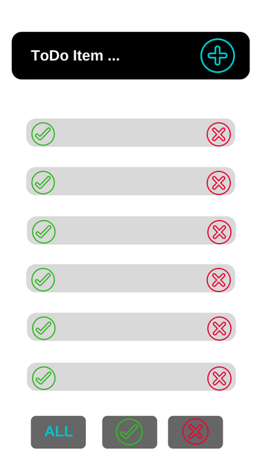

# TO-DO Application

Create a simple ToDo list application using HTML, Sass, JavaScript and the jQuery library.

### Getting Started

> NOTES
> * Before you begin coding, sketch out your application. Include your designs in your repo.
> * Before you begin coding, write notes about WHAT happens, WHEN.
> * Before you begin coding, do some data modeling! Begin by making mock data in JSON either on paper or in a file for your notes.
> * Be sure to include and link to it.

#### Sketch


#### When - WHAT

* Page Loads
  *  Grab data
* Data returns
    * Display list view
* Click submit
    * Send data
* Data Saved
    * Display list view
* Checkbox clicked
    * Verify data
* X clicked
    * Delete current data
* Check filter clicked
    * Display all check data      

```JSON
[
  {
    "_id": "58d181accd0be70400560c84",
    "isChecked": true,
    "item": "Start Project"
  },
  {
    "_id": "58d1817bcd0be70400560c81",
    "isChecked": false,
    "item": "Feed Cat"
  },
  {
    "_id": "58d180fccd0be70400560c7d",
    "isChecked": false,
    "item": "Grocery Store"
  }
]
```    
### Live on Surge

voracious-fly.surge.sh
